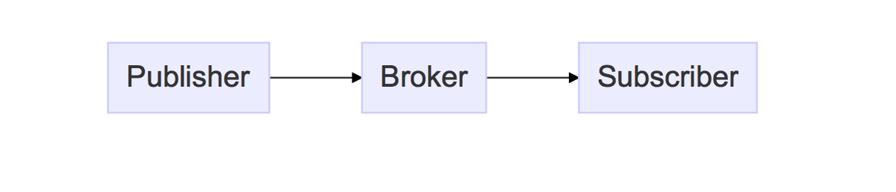

# 33.MQTT(Message Queue Telemetry Transport)

##<u>目的</u>
IoT に適したプロトコルとして脚光を浴びている MQTT プロトコルの、事実上の標準実装である mosquitto MQTT Broker の準備、利用方法を理解する  

##<u>実習手順</u>
自身の gc16 に terminal でログインする

1. トポロジの理解: mqtt はブローカーを介してメッセージ・キューのような pub & sub 型のトポロジとなる  
  
IoT クライアントは取得したデータを publisher として Broker に通知する  
Broker は subscriver にデータを通知する

2. （任意）mqtt broker の起動、終了  
mqtt broker `mosquitto` が既にインストールしてあり、自動起動する設定になっている  
設定の変更は以下  
  - 終了: `sudo systemctl stop mosquitto.service`
  - 起動: `sudo systemctl start mosquitto.service`
  - 再起動: `sudo systemctl restart mosquitto.service`
  - disable: `sudo systemctl disable mosquitto.service`
  - enable: `sudo systemctl enable mosquitto.service`

3. subscriver の登録  
`mosquitto_sub` コマンドを -h オプションにサーバを、-t オプションに # を指定して実行
```
pi@gc1624:~ $ mosquitto_sub -h gc1624.local -t "#"
```  
-t オプションの意味は後に説明する

4. publisher の実行  
もう一枚 terminal を開き、そこから  
`mosquitto_pub` コマンドを -h オプションでサーバを、-t オプションに "topic" と指定し、-m オプションに適当なメッセージを入れて実行
```
pi@gc1624:~ $ mosquitto_pub -h gc1624.local -t "topic" -m "こんにちは"
```

5. `mosquitto_pub` の実行と同時に、先の`mosquitto_sub`を実行中の terminal にそのメッセージが通知される
```
pi@gc1624:~ $ mosquitto_sub -h gc1624.local -t "#"
こんにちは
```
6. mosquitto_pub 側の terminal で `CNTL+C` で mosquitto_pub を終了

7. -t はトピックオプションで、mqtt ではトピックを指定してメッセージ通信を行う  
トピックは階層構造を持ち、`#`は全てを表す  
今度は、自分が属する router (各々、gc16router, gc16router2) の broker に、RPi からメッセージを送信してみる  
terminal から以下のように`/自分のRPiのホスト名/temp`とトピックを指定して `mosquitto_sub` コマンドを実行する
```
pi@gc1624:~ $ mosquitto_sub -h gc16router.local -t "/gc1624/temp"
```

8. もう一枚の terminal から -h に自分のルーターを指定して下記のトピックとメッセージでメッセージを送る  
```
pi@gc1624:~ $ mosquitto_pub -h gc16router.local -t "topic" -m "こんにちは"
```  
この時、publisher には何も通知されない。***topic が合っていない*** からである

9. 下記のようにトピックに`/自分のRPiのホスト名/`としてメッセージを送っても、やはりトピックがあっていないのでメッセージは publisher に publish されない  
```
pi@gc1624:~ $ mosquitto_pub -h gc16router.local -t "/gc1624" -m "23.5℃"
```  

10. publisher に指定した topic と同じトピックで送信する。今度は publish される
```
pi@gc1624:~ $ mosquitto_pub -h gc16router.local -t "/gc1624/temp" -m "23.5℃"
```

10. 下記もトピックが一致していないので publish されない  
```
pi@gc1624:~ $ mosquitto_pub -h gc16router.local -t "/gc1624/humidity" -m "23.5℃"
```  
以上、`/クライアント名/センサデータ名/` や `/アカウント/クライアント名/センサデータ名/` のように topic を階層化して publish と subscrive することで、一台の MQTT Broker を介して多数のクライアントが多種にわたるデータを通信することができる

11. 再度、mosquitto_pub 側の terminal で `CNTL+C` で mosquitto_pub を終了し、topic を `/tmep` としt sbscriver を起動
```
pi@gc1624:~ $ mosquitto_sub -h gc16router.local -t "/temp"
```

12. もう一枚の terminal で、各々自由な温度をメッセージとして publish
```
mosquitto_pub -h gc16router.local -t "/temp" -m "23.5℃"
```  
多数のクライアントからメッセージが混信する。topic を階層化する必要性がわかる

### （任意）mosquitto のインストール
1. 下記スクリプトを参照  
```
pi@gc1624:~ $ cat install/gc_setups/mosquitto.setup.sh
```  
尚、WebSocket が不要であれば単に apt-get install でよい

### python からの利用
python から mqtt を利用するモジュールはいくつかあるが、ここでは paho を紹介する
```
pi@gc1624:~ $ cat -n /var/www/html/SCRIPT/monitor/hmqp.py
     1	# coding:utf-8 Copy Right Atelier Grenouille © 2015 -
     2	#
     3	# hmqp:
     4	#
     5	# A mqtt bridge of http for a limited purpose.
     6	#
     7	# refered http://tdoc.info/blog/2014/09/25/mqtt_python.html
     8
     9	import paho.mqtt.client as mqtt
    10	import json
    11	import requests
    12
    13	# 定数
    14	server_url_base = "http://localhost/" # Server 毎に変更が必用
    15	url_data = server_url_base + 'postdata.php'
    16
    17	def on_connect(client, userdata, rc):
    18	    print("Connected with result code "+str(rc))
    19	    client.subscribe("gal/gal4/#")
    20
    21	def on_message(client, userdata, msg):
    22	    print(msg.topic+" "+str(msg.payload))
    23	    payload = json.loads(msg.payload)
    24	    r = requests.post(url_data, data=payload, timeout=10, verify=False)
    25
    26
    27	if __name__ == '__main__':
    28
    29	    client = mqtt.Client(client_id="ueda-spam", clean_session=True, protocol=mqtt.MQTTv311)
    30	    client.on_connect = on_connect
    31	    client.on_message = on_message
    32
    33	    client.connect("127.0.0.1", 1883, 60)
    34
    35	    client.loop_forever()
```  
ポイントは以下
  - 9行: paho のインポート
  - 17行: on_connect のハンドラの定義
  - 19行: subscribe の実装
  - 21行: on_message のハンドラの定義
  - 24行: 自分自身に POST
  - 29行: mqtt のクライアントを作成
  - 30 - 31行: ハンドラの登録
  - 33行: mqtt broker に接続
  - 35行: イベントループ
